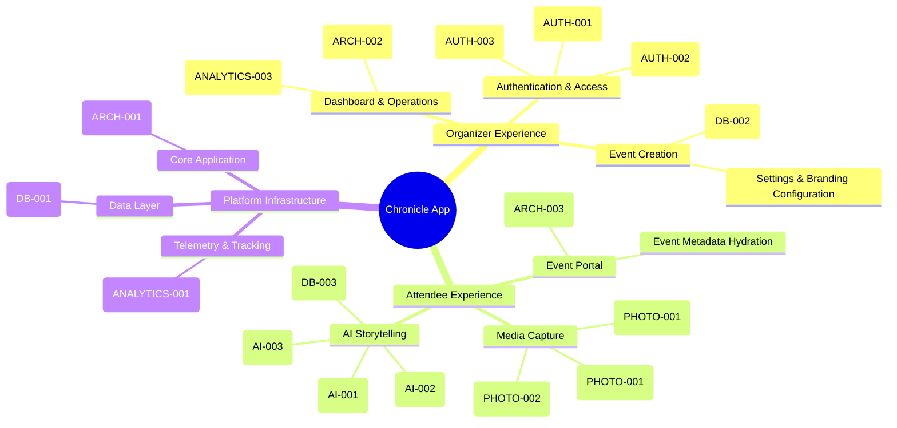

# Chronicle Functionality Map

This map provides a structural, topological view of the Chronicle product. While the `TASK-TREE.md` organizes work by implementation phases (when things get built), this map organizes work by **Functional Product Areas** (what things do).

## Why this map is valuable

1. **Contextual Awareness:** A developer picking up task `AI-002` (Zod Output Validation) can instantly see where it fits in the broader product architecture (Platform -> Attendee -> AI Storytelling).
2. **Product Topology vs. Project Timeline:** It breaks free of the chronological "Phase 1, Phase 2" timeline and shows you the actual shape of the software being built.
3. **Gap Analysis:** If a major branch of this tree has no atomic tasks associated with it, it immediately highlights a missing area in the implementation plan that needs to be researched and decomposed.
